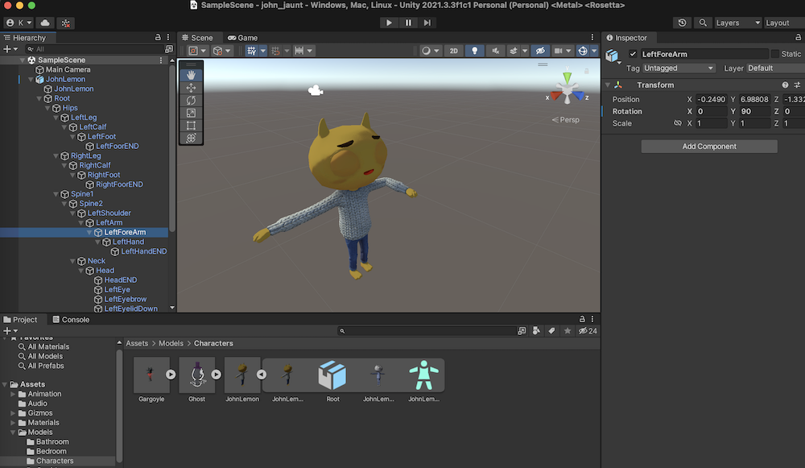
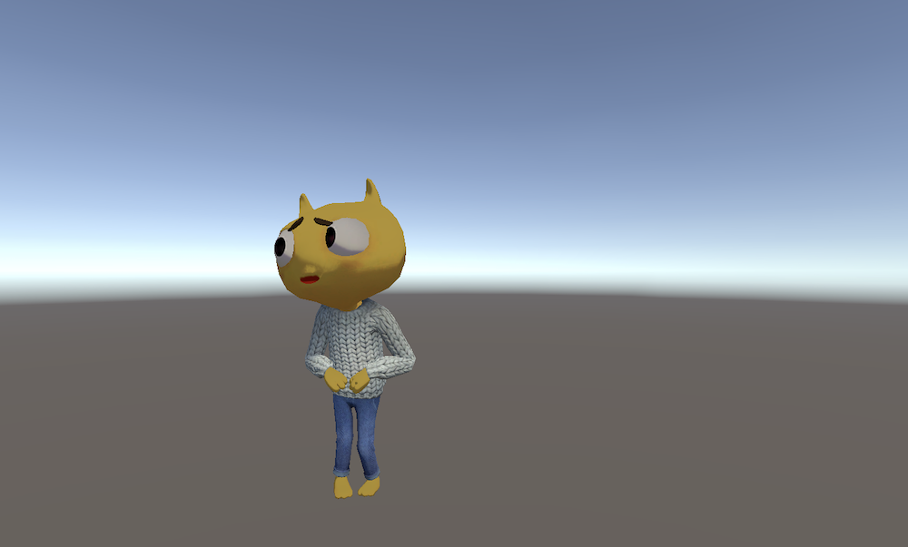

- guide

        https://learn.unity.com/project/john-lemon-s-haunted-jaunt-3d-beginner?start=true (unity editor 2020.3)

        https://learn.unity.com/project/lego-template (unity editor 2021.3 / 2020.3 ...)

- get started

        - install unity editor 2021.3.3

        - new 3d project
        
        - import assets
        
                add to my asset > open in unity (open in the project's package manager) > download > import
                https://assetstore.unity.com/packages/templates/tutorials/3d-beginner-tutorial-resources-143848

        - models
        
                Most things that you see in a 3D game are models, including characters, the environment and props. These are usually created outside of Unity, and are then imported and given functionality to make a game
                
                import 3d model / FBX
                Assets > Models > Characters > JohnLemon.fbx > drag into main scene

                FBX = filmbox format, 3d file import/export between 3D animation software, such as Maya, 3ds Max, MotionBuilder, Mudbox and other third-party software

        - Skinned Mesh Renderer / bones
        
                Models are made up of a mesh of triangles, and a Mesh Renderer "renders" that mesh so you can see it.  A Skinned Mesh Renderer is a special type of Mesh Renderer that allows the mesh to change shape based on the positions and rotations of all of a model’s bones.  These bones are child GameObjects of the model

                game object JohnLemon > JohnLemon > Skinned Mesh Renderer
                                      > Root > Hips/bones
                                                        > left leg
                                                        > right leg

        - animate
        
                select LeftForeArm. > Rotation field and set the Y value to 90

                the Animator component on the character’s parent GameObject will change the rotation of all the bone GameObject Transform components, and these changes will happen together to animate the character

                

        - create Prefab
                
                drag john into assets/prefabs

        - Animator Controller / state machine
        
                assets > animation > animators > create animator controller 'JohnLemon'
                
                animator controller = parameters + state machine

                create parameter IsWalking of bool type

                assets > animation > animation > drag john@idle & john@walk into animator controller/stage machine

                right click on state idle/walk, make Transition to each other

                select arrow line from idle to walk > uncheck Has Exit Time checkbox > +condition > IsWalking = true
                select arrow line from walk to idle ...

                drag the animator controller into JohnLemon Prefab, as animator component

        - add rigidbody / physics system
        
                JohnLemon Prefab > add component > rigidbody

                - try play
                fly/fall, update loop issue

                - fix
                select the animator component > update mode, change to animate physics

                - root motion
                Animations are used to move and rotate all the GameObjects within a particular hierarchy.  Most of these movements and rotations are done relative to their parents, however the parent GameObject of the hierarchy has no parent and therefore their movement is not relative. This parent GameObject can also be called the Root, and its movement is therefore called Root Motion

                - prevent from flying/dropping when collides
                RigidBody component > constraints > Freeze Position Y checkbox, Freeze Rotation X  and Z checkboxes

        - add collider

                john prefab > add component > Capsule Collider
                
                Height = 1.4 
                Center property to (0, 0.7, 0).
                radius = 0.4

- write script for character movement

        - create script
                
                assets/script > create PlayerMovement
                john prefab > add script PlayerMovement

        - play

                

- add environment

        - add environment
                
                Assets > Prefabs and select the Level Prefab > drag into Hierarchy section 
                set john position  (-9.8, 0, -3.2).

        - light

                Hierarchy > select directional light > color/Intensity/Shadows/Rotation

        - Lightmapping / indirect lighting

        - add Navigation Mesh

                The NavMesh is an invisible shape over the ground that defines an area within which selected GameObjects(our ghosts) can move.  

- set camera

        - Cinemachine

                

        - Add Post-Processing Effects

- editing the game / UI / game ending trigger / script

- enemies, static

- enemies, dynamic

- audio

- build, run, distribute

        

        

        

